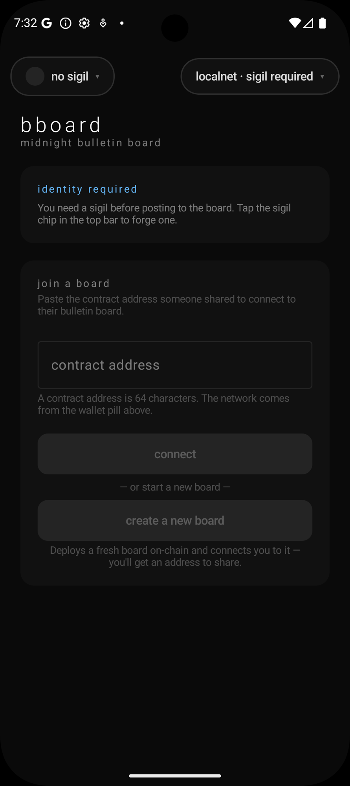

<section class="kuira-hero" markdown>
<canvas class="kuira-hero__canvas" data-component="starfield" aria-hidden="true"></canvas>

<div class="kuira-hero__inner" markdown>
<div class="kuira-hero__eyebrow"><span>Kuira · v{{ kuira_version }}</span><span>Maven Central</span></div>

<h1 class="kuira-hero__headline">Zero-knowledge apps that <em>prove on the phone</em> — no server, no seed phrase.</h1>

<p class="kuira-hero__lede">
Kuira is the Android SDK for Midnight: on-device ZK proving, passkey identity, an embedded wallet, and the Compact runtime — the full private-app stack, self-custodial. Built to pair with your coding agent: every recipe ships a one-tap prompt.
</p>

<div class="kuira-hero__cta">
<a href="#templates" class="md-button md-button--primary">Get started</a>
<a href="integration/" class="md-button">Read the integration guide</a>
<a href="https://github.com/kuiralabs/kuira-starter-android" class="md-button">Clone the starter</a>
</div>
</div>
</section>

<section class="kuira-templates" id="templates" markdown>

<div class="kuira-templates__header" markdown>
<h2 class="kuira-templates__title">Try it now — clone a working dApp</h2>
<p class="kuira-templates__subtitle">
The fastest way in: a complete, runnable app you make your own. Copy the prompt into your coding agent — it clones the repo and walks the setup as a task list you can watch.
</p>
</div>

<div class="kuira-templates__grid" markdown>

<article class="kuira-template" markdown>

<div class="kuira-template__body" markdown>
<span class="kuira-template__eyebrow">Starter</span>
<h3 class="kuira-template__title">Kuira Starter</h3>
<p class="kuira-template__desc">
A minimal counter dApp — Sigil identity, embedded wallet, and a 6-line Compact contract you deploy and increment on-chain. ~250 lines, also a GitHub template.
</p>
<div class="kuira-template__actions" data-copy-prompt="https://raw.githubusercontent.com/kuiralabs/kuira-starter-android/main/README.md" data-task="Clone the Kuira Starter Android template and get it running on a device, then help me customize it."></div>
</div>
</article>

<article class="kuira-template" markdown>

<div class="kuira-template__body" markdown>
<span class="kuira-template__eyebrow">Example</span>
<h3 class="kuira-template__title">BBoard</h3>
<p class="kuira-template__desc">
An on-chain bulletin board — the deploy → call → read flow end-to-end: create a board, post and take down messages, or connect to one someone shared.
</p>
<div class="kuira-template__actions" data-copy-prompt="https://raw.githubusercontent.com/kuiralabs/example-bboard-android/main/README.md" data-task="Clone the BBoard Android example and get it running on a device, then help me customize it."></div>
</div>
</article>

</div>
</section>

<section class="kuira-picker" id="kuira-picker" markdown>
<div class="kuira-picker__header" markdown>
<h2 class="kuira-picker__title">Already have an app? Add Kuira with your agent</h2>
<p class="kuira-picker__subtitle">
Integrating Kuira into an existing project, or following a specific recipe? Pick a task and your agent — we generate the prompt; you paste it in, and the agent works the steps as a task list.
</p>
</div>

<div class="kuira-picker__row" markdown>
<span class="kuira-picker__label">What do you want to build?</span>
<div class="kuira-picker__options" role="radiogroup" aria-label="Recipe">
<button class="kuira-picker__chip" type="button" role="radio" aria-pressed="true" data-task-key="add-kuira-to-an-android-project" data-task-title="Add the Kuira SDK">Add Kuira to a project</button>
<button class="kuira-picker__chip" type="button" role="radio" aria-pressed="false" data-task-key="bind-your-app-to-a-passkey-domain" data-task-title="Bind your app to a passkey domain">Bind to a passkey domain</button>
<button class="kuira-picker__chip" type="button" role="radio" aria-pressed="false" data-task-key="set-up-sigil-identity" data-task-title="Set up Sigil identity">Set up Sigil identity</button>
<button class="kuira-picker__chip" type="button" role="radio" aria-pressed="false" data-task-key="hello-compact" data-task-title="Write a minimal Compact contract">Hello Compact</button>
<button class="kuira-picker__chip" type="button" role="radio" aria-pressed="false" data-task-key="deploy-and-call-a-compact-contract" data-task-title="Deploy a Compact contract and call a circuit">Deploy a Compact contract</button>
<button class="kuira-picker__chip" type="button" role="radio" aria-pressed="false" data-task-key="run-kuira-doctor" data-task-title="Wire and run kuiraDoctor preflight">Run kuiraDoctor</button>
</div>
</div>

<div class="kuira-picker__row" markdown>
<span class="kuira-picker__label">For your agent</span>
<div class="kuira-picker__options" role="radiogroup" aria-label="Agent">
<button class="kuira-picker__chip" type="button" role="radio" aria-pressed="true" data-agent-key="claude" data-agent-name="Claude Code">Claude Code</button>
<button class="kuira-picker__chip" type="button" role="radio" aria-pressed="false" data-agent-key="cursor" data-agent-name="Cursor">Cursor</button>
<button class="kuira-picker__chip" type="button" role="radio" aria-pressed="false" data-agent-key="codex" data-agent-name="Codex">Codex</button>
<button class="kuira-picker__chip" type="button" role="radio" aria-pressed="false" data-agent-key="generic" data-agent-name="any LLM">Generic LLM</button>
</div>
</div>

<div class="kuira-picker__output" markdown>
<span class="kuira-picker__label">Your prompt</span>
<pre class="kuira-picker__prompt" id="kuira-picker-output" aria-live="polite">Building prompt…</pre>
<div class="kuira-picker__actions">
<button class="kuira-picker__action kuira-picker__action--primary" type="button" id="kuira-picker-copy"><span aria-hidden="true">📋</span> Copy prompt</button>
<a class="kuira-picker__action" id="kuira-picker-raw" href="#" target="_blank" rel="noopener"><span aria-hidden="true">📄</span> View raw context bundle</a>
</div>
</div>
</section>

<section class="kuira-features" markdown>
<article class="kuira-feature" markdown>
<span class="kuira-feature__eyebrow">Identity</span>
<h3 class="kuira-feature__title">Passkey-derived sigil</h3>
<p class="kuira-feature__body">
One biometric mints a DID + wallet seed. PRF on the passkey assertion — no seed phrases at onboarding, recoverable on any device that shares the Google account.
</p>
</article>
<article class="kuira-feature" markdown>
<span class="kuira-feature__eyebrow">Wallet</span>
<h3 class="kuira-feature__title">Embedded, no custodian</h3>
<p class="kuira-feature__body">
Shielded + unshielded balance, transaction balancing, indexer sync, Dust regeneration. The wallet lives in your app's process; you never call out to a separate wallet.
</p>
</article>
<article class="kuira-feature" markdown>
<span class="kuira-feature__eyebrow">Contracts</span>
<h3 class="kuira-feature__title">Compact runtime + ZK proving</h3>
<p class="kuira-feature__body">
Deploy and call Compact circuits on-device. QuickJS contract runtime, witness packing, per-circuit proving keys, transaction submission — wired by a Gradle plugin.
</p>
</article>
</section>

<section class="kuira-modules" markdown>
<div class="kuira-modules__title">16 modules · pull <code>dapp-ui</code>, get the graph</div>
<div class="kuira-modules__list">
<span class="kuira-modules__pill">dapp-ui</span>
<span class="kuira-modules__pill">midnight-sdk</span>
<span class="kuira-modules__pill">wallet-runtime</span>
<span class="kuira-modules__pill">wallet-seed</span>
<span class="kuira-modules__pill">identity</span>
<span class="kuira-modules__pill">auth</span>
<span class="kuira-modules__pill">crypto</span>
<span class="kuira-modules__pill">compact-engine</span>
<span class="kuira-modules__pill">indexer</span>
<span class="kuira-modules__pill">connector</span>
<span class="kuira-modules__pill">ledger</span>
<span class="kuira-modules__pill">network</span>
<span class="kuira-modules__pill">wallet</span>
<span class="kuira-modules__pill">designsystem</span>
<span class="kuira-modules__pill">testing</span>
<span class="kuira-modules__pill">contract-plugin</span>
</div>
</section>

## Install

=== "Gradle (Kotlin DSL)"

    ```kotlin
    // settings.gradle.kts
    dependencyResolutionManagement {
        repositories {
            mavenCentral()
        }
    }

    // app/build.gradle.kts
    dependencies {
        implementation("io.github.kuiralabs:dapp-ui:{{ kuira_version }}")
    }
    ```

=== "Gradle (Groovy)"

    ```groovy
    // settings.gradle
    dependencyResolutionManagement {
        repositories {
            mavenCentral()
        }
    }

    // app/build.gradle
    dependencies {
        implementation 'io.github.kuiralabs:dapp-ui:{{ kuira_version }}'
    }
    ```

`dapp-ui` `api`-exposes the consumer surface, so a single line gives
you the complete SDK graph. Need just the headless wallet? Use
`midnight-sdk` instead.

[Full integration guide →](integration.md){ .md-button .md-button--primary }
[Security & verification](security.md){ .md-button }

**Working examples** — clone, build, read the source:
[Kuira Starter](https://github.com/kuiralabs/kuira-starter-android) (minimal counter, also a GitHub template) ·
[BBoard](https://github.com/kuiralabs/example-bboard-android) (on-chain bulletin board).

---

## Built for AI-assisted development

The cookbook is the source of truth for both humans and agents. Every
recipe is a raw markdown file at a stable URL — agents fetch it
directly. A site-root [`/llms.txt`](llms.txt) lists every recipe, per
the emerging [llms.txt](https://llmstxt.org) convention.

For maintainers: the SDK source lives in a private repository. Source
jars ship next to every AAR on Maven Central, so you can read, audit,
or step into the implementation through any IDE.

---

## Known limitations · {{ kuira_version }}

Honest naming of where the SDK doesn't go yet. None of these block the
"identity + wallet + contract call" core path; each will close in a
future release.

| Gap | Workaround today | Closes in |
|---|---|---|
| **No Compact authoring deep-dive on the Kuira side** — the SDK consumes compiled `.compact` artifacts but does not teach the full Compact language. Witnesses, ZK patterns, selective-disclosure idioms, multi-party state — all live in the Midnight project's documentation, not Kuira's. | Start with the [Hello Compact](recipes/hello-compact.md) recipe for the minimum-viable counter and the toolchain pin matrix, then follow it to the [official Midnight contract examples](https://github.com/midnightntwrk/midnight-docs/tree/main/docs/examples/contracts) for everything beyond. | Closed by intent — the Kuira SDK is the runtime; Midnight owns the language. |
| **No recovery-phrase export (BIP-39 mnemonic)** — Sigil-derived wallets currently have no sovereign exit; recovery rides Google account availability. | Keep access to your Google account. PRF derivation is deterministic, so the wallet re-derives from the passkey. | `alpha03` |
| **No session auto-lock** — once a Sigil session is unlocked, value-bearing calls don't re-prompt for biometrics until the process is killed. | Treat an unlocked session as funds-on-screen. Sign out from the Sigil panel to lock manually. | `alpha03` |
| **SDK source not browsable on GitHub** — the Dokka API reference doesn't link to source. | A `-sources.jar` ships next to every artifact on Maven Central; Android Studio / IntelliJ auto-attach it, so you can step into the implementation as usual. | By design — sources travel with the artifacts |
| **BLS proving params from Midnight's dev S3 bucket** — `midnight-s3-fileshare-dev-eu-west-1`, a supply-chain assumption labeled "dev." | None — this lives at the protocol-team layer; per-contract proving keys are unaffected (each dApp hosts its own). | When Midnight publishes a production URL |
| **Android only** — no iOS, no React Native bridge, no JS interop. | If you need cross-platform, build the same surface twice for now. | iOS support is planned |

For **security-domain gaps** — what the threat model does and doesn't
cover (compromised devices, malicious co-process dApps, session-cache
theft) — see [Security](security.md) § *What Kuira does NOT protect
against*.

---

## What's coming next — Sigil V2

The currently-shipped sigil architecture (**Sigil V1**) derives the
wallet seed deterministically from a passkey PRF assertion. That gives
a one-tap onboarding story but binds the sigil to a single WebAuthn
`rpId` — so a user's funds cannot be shared across multiple Kuira
apps that ship under different domains, and recovery is gated on the
same Google account holding the synced passkey.

**Sigil V2** keeps the one-tap-onboarding promise but treats the
master seed as portable data: PRF becomes an *unlock key* for a
persisted seed envelope rather than the seed itself. Three properties
follow:

- **Cross-app sigil portability via explicit enrollment.** A user
  installs a second Kuira app, taps "Use my Kuira sigil from
  \[Wallet]," and the existing app hands the seed over a secure
  biometric-gated AIDL channel. Both apps now share the same wallet,
  same DID, same on-chain history.
- **Cross-device, cross-Google-account recovery.** PIN-based
  recovery via an opaque cloud bucket (Signal SVR2 pattern, no
  enclave needed); the seed survives device loss and account
  changes.
- **Midnight Passport plug-in path.** Versioned envelope codec +
  storage-tier interface + frozen HKDF signer namespace reserve a
  clean integration surface for Midnight's protocol-native account
  abstraction, universal DID, and verifiable-credential layers when
  Passport's spec is public.

The same primitive is already shipped in production by Dashlane,
Bitwarden, 1Password, Signal SVR2, and WhatsApp E2EE backups — five
independent systems that converged on the same shape for the same
reason.

Sigil V2 is the **next architecture** for Kuira, not the next alpha.
The master-seed lifecycle, tiered storage, and cross-app enrollment come
first; cloud-bucket PIN recovery follows.

---

## License

Apache License 2.0 — see [LICENSE](https://github.com/kuiralabs/kuira-sdk-android/blob/main/LICENSE).
